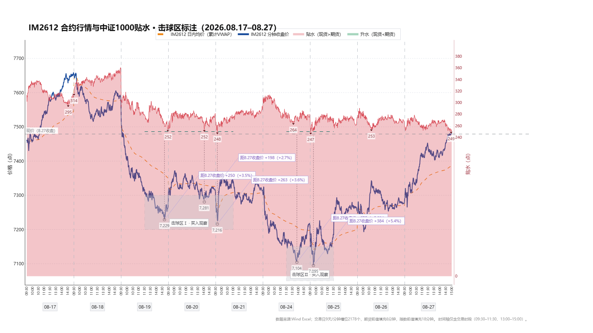
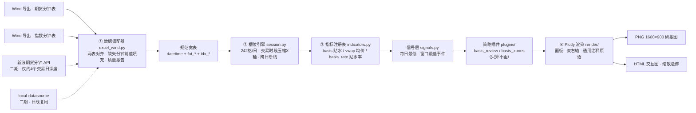
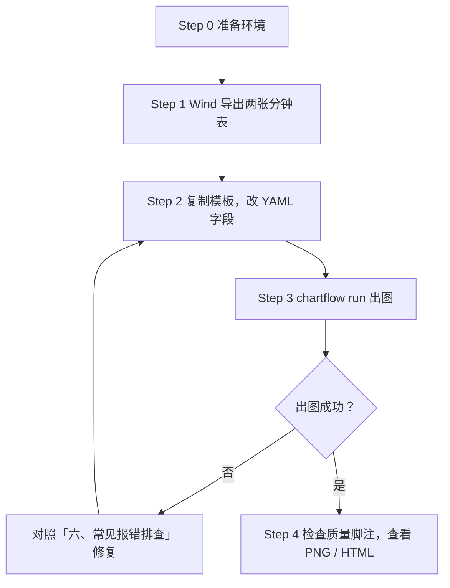
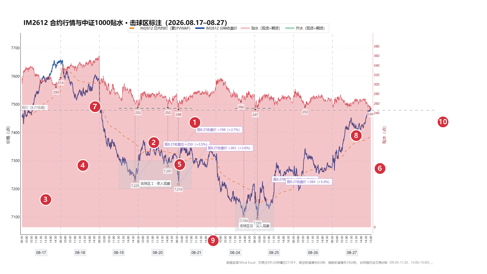

# quant-chart

**YAML 驱动的行情图工作流**：准备好数据两表、改几行配置，一条命令产出研报级行情图（PNG）和可缩放交互图（HTML）。内置中证1000股指期货贴水监控两套预设，贴水、击球区、买卖观察窗等要素开箱即用。



---

## 一、架构介绍

### 1.1 四段流水线



### 1.2 三层配置理念：改需求只动对应的层

| 你想改什么 | 动哪里 | 举例 |
|---|---|---|
| 数据（换合约、换区间） | `input` | 换两个 Excel 路径、改 `range` |
| 计算（策略参数、击球区、触发线） | `strategy` + `params` | 改 `trigger: 250`、增删 `zones` |
| 外观（画什么线、什么颜色） | `panels.layers` | 一般不用动，插件已给默认图层 |

90% 的日常需求只动前两层，不用碰任何代码。

### 1.3 目录结构

```
quant-chart/
├── configs/               # 配置模板（复制一份改成你的）
├── src/quantchart/
│   ├── adapters/          # ① 数据适配（Wind Excel；API 属二期）
│   ├── core/              # ②③ 槽位引擎 / 指标 / 信号 / 插件注册 / 流水线
│   ├── render/            # ④ Plotly 原语翻译与面板组装
│   └── plugins/           # 策略插件（basis_review / basis_zones）
├── tests/                 # 单测 + 真实数据回归
└── docs/                  # 设计文档 / 实施计划 / 图片
```

---

## 二、操作手册（从零到出图）

### 操作流程总览



### Step 0：准备环境

- Python ≥ 3.12
- 本机装有 **Chrome 浏览器**（kaleido 静态出图依赖它）
- 安装本包（在仓库根目录）：

```bash
pip install -e ".[dev]"
```

验证：`chartflow --help` 能打印帮助即安装成功。

### Step 1：准备数据（两张 Excel）

从 Wind 导出**两张分钟级 Excel**，一张期货、一张现货指数。要求：

| 要求 | 说明 |
|---|---|
| 列名（10 列，顺序不限） | `代码, 名称, 日期, 开盘价(元), 最高价(元), 最低价(元), 收盘价(元), 涨跌幅, 成交额(百万), 成交量(股)` |
| 粒度 | 每行一个分钟；交易时段内的分钟（午休、周末本来就没有） |
| 时间覆盖 | 两张表都覆盖你要分析的日期区间 |
| 脚注行 | 末尾的“数据来源：Wind”行**允许存在**，程序自动剔除 |
| 缺失分钟 | 个别分钟缺失没关系，程序自动**前值填充**，并在图脚注报告填充数量 |

> 示例数据即 `E:/LLMproject/PersonalAffairs/Backset/` 下的 `IM2612.CFE原始.xlsx`（期货）与 `000852.SH.xlsx`（指数），可参照其格式。

### Step 2：复制模板，改 YAML

```bash
mkdir my
cp configs/basis_zones.yaml my/first.yaml
```

打开 `my/first.yaml`，按下表逐字段修改（模板里的路径是示例，务必替换成你自己的）：

| 字段 | 必填 | 含义 | 示例值 |
|---|---|---|---|
| `input.mode` | 是 | 数据模式。**本期只能 `excel`**（`auto`/`api` 属二期，写了会报错） | `excel` |
| `input.excel.future` | 是 | 期货分钟表路径。Windows 路径请用正斜杠 `/` | `E:/data/IM2612.CFE原始.xlsx` |
| `input.excel.index` | 是 | 指数（现货）分钟表路径 | `E:/data/000852.SH.xlsx` |
| `input.range` | 是 | 分析区间 `[起始日, 结束日]`，闭区间 | `[2026-08-17, 2026-08-27]` |
| `strategy` | 是 | 策略预设：`basis_review`=纯行情+贴水+每日最低；`basis_zones`=再加击球区/触发线/低点价差标注 | `basis_zones` |
| `title` | 否 | 图表标题（也可用命令行 `--title` 覆盖） | `"IM2612 行情与贴水"` |
| `params.trigger` | zones 用 | 贴水触发线数值（点），画在击球区内 | `250` |
| `params.zones[].from / to` | zones 用 | 击球区起止时间 `"YYYY-MM-DD HH:MM"`，**必须落在数据区间内的交易时段** | `"2026-08-19 11:30"` |
| `params.zones[].price` | zones 用 | 击球区价格带 `[下沿, 上沿]`（点） | `[7200, 7300]` |
| `params.zones[].label` | zones 用 | 击球区标签文字，显示在框内底部 | `"击球区Ⅰ"` |
| `trades` / `trades_csv` | 否 | 手填交易明细列表（或 CSV 路径，二选一）。每条 `{time, action, lots, price?}`，action ∈ buy/sell/close，close 的 lots 写 `all`；缺 price 用该分钟收盘价。配置后自动在主图标注买卖点（买▲红/卖▼绿/平×灰）并在数据中生成仓位 | `[{time: "2026-08-21 09:39", action: buy, lots: 1}]` |
| `contract_mult` | 否 | 合约乘数，用于 `position_value`（手数×乘数×价） | `200` |
| `extra_panels` | 否 | 在默认面板后**追加**面板（`panels` 是整体替换，两者可并用）。可选键 `y_title`（轴标题）、`range_cols`（按哪些列定 Y 轴范围） | 见 `configs/basis_zones_position.yaml` 仓位面板 |

### Step 3：一条命令出图

```bash
chartflow run my/first.yaml -o out.png --html out.html
```

| 选项 | 说明 |
|---|---|
| `-o, --output` | 输出 PNG 路径（默认 `out.png`，固定 1600×900；目录不存在会自动创建） |
| `--html` | 同时输出交互 HTML 的路径（不给则不出 HTML） |
| `--title` | 覆盖 YAML 里的 `title` |

成功时控制台输出（最后一行是数据质量脚注，也会印在图的底部）：

```
PNG  -> out.png
HTML -> out.html
数据来源:Wind Excel；交易日9天/分钟槽位2178个，期货前值填充6分钟，指数前值填充18分钟。
```

### Step 4：查看结果

- **PNG**：白底研报风格，直接插入报告/聊天工具。
- **HTML**：双击用浏览器打开，可**拖框缩放**看分钟细节、**悬停**查任意分钟的数值。注意 HTML 依赖 Plotly CDN，**需联网**首次加载。

---

## 三、图例说明



| 编号 | 要素 | 含义 | 来自哪里 |
|---|---|---|---|
| ① | 分钟收盘价线（深蓝实线） | 期货每分钟收盘价，左轴 | 插件默认图层 |
| ② | 日内均价线（橙色虚线） | 当日累计成交额÷累计成交量，每日重置 | 插件默认图层 |
| ③ | 贴水面积（红/绿，右轴） | 贴水=现货−期货；红=贴水、绿=升水；右侧外轴为贴水率% | 插件默认图层 |
| ④ | 每日贴水最低倒三角 | 每个交易日的贴水最低点数值；**黑色**=当日曾触及触发线 | 插件默认图层 |
| ⑤ | 击球区矩形 | 买入观察窗（时间×价格带） | `params.zones` |
| ⑥ | 区内触发线（墨绿虚线） | 贴水=trigger 的参考线，只画在击球区内 | `params.trigger` |
| ⑦ | 现价基准线（灰虚线） | 区间最后一分钟收盘价，横贯全图 | 插件默认图层 |
| ⑧ | 低点连线+价差标注（紫） | 击球区窗口内各交易日最低价，虚线连到现价线，标注“距末日收盘价 +价差（+涨幅%）” | `params.zones` |
| ⑨ | 日期行 | 每个交易日的日期，置于时间刻度下方独立一行 | 引擎自动 |
| ⑩ | 右侧双轴 | 贴水（点）与贴水率（%） | 引擎自动 |
| ⑪ | 仓位阶梯线（下面板）与买卖点标记 | 下面板净持仓阶梯（0→1→2→0，hv 阶梯）；主图买▲红/卖▼绿/平×灰标在成交分钟 | 顶层 `trades` + `extra_panels`（示例 `configs/basis_zones_position.yaml`） |

X 轴只含实际交易时段（09:30–11:30、13:00–15:00），午休与跨日间隙自动压缩、跨日不连线。

---

## 四、数据来源与二期路线

### 4.1 为什么本期只用 Excel

实测（2026-08）免费接口对**分钟级历史**的能力：

| 来源 | 分钟深度 | 结论 |
|---|---|---|
| 新浪期货分钟 | 仅约 4 个交易日 | 只够“最近几天快速看” |
| 腾讯指数分钟 | 约 3 个交易日 | 同上 |
| 东财 push2his | 当时整域拒绝访问 | 不稳定 |
| 通达信 pytdx | 指数响应乱码、中金所服务器停服 | 不可用 |

因此 **Wind 导出 Excel 是分钟级数据的唯一可靠主通道**，深度不限、离线可用。

### 4.2 二期：统一走 local-datasource（契约 v1.1）

分钟/日线统一经 [local-datasource](https://github.com/jarvislee90s-dot/local-datasource) 接入（CSV 读回形态，消费契约 v1.1）：本期 `mode` 新增 `auto`/`api`——`api` 只走 local-datasource，覆盖不足时明确报"从 Wind 导出 Excel 补数"指引；`auto` 在覆盖不足且配置了 Excel 时**整体**降级改用 Excel（图脚注标注降级来源，不静默、不做区间拼接）。Excel 用于补 API 覆盖不到的历史区间，仍是深度不限的可靠主通道。

---

## 五、常见改法速查

| 想做什么 | 改哪里 |
|---|---|
| 换分析区间 | `input.range` 两行日期 + `title` 里的日期 |
| 换合约 / 换指数 | `input.excel.future` 与 `input.excel.index` 两个路径 |
| 调整击球区窗口或价格带 | `params.zones` 的 `from`/`to`/`price` |
| 增删击球区 | `params.zones` 列表增删条目（每个区自动带触发线与低点标注） |
| 不要击球区，只看行情+贴水 | `strategy: basis_review`，删掉 `params` 段 |
| 改贴水触发线 | `params.trigger` |
| 只改标题 | `title` 或命令行 `--title` |
| 想看自己的仓位 | 顶层写 `trades` + `extra_panels` 仓位面板（完整示例 `configs/basis_zones_position.yaml`） |

## 六、常见报错排查

| 报错（节选） | 原因 | 解决 |
|---|---|---|
| `缺少必填字段: input` / `缺少必填字段: strategy` | YAML 顶层缺字段 | 按报错补上对应字段 |
| `input.mode=excel 需要 input.excel.future 与 input.excel.index 两表路径（缺失: input.excel.index）` | excel 段缺表路径 | 按括号里的字段路径补齐 |
| `auto 模式（API优先降级）属二期…` | `mode` 写了 `auto` 或 `api` | 本期改为 `mode: excel` |
| `FileNotFoundError: ...xlsx` | Excel 路径不对 | 检查路径，Windows 用正斜杠 `/` |
| `时间点不在数据中: 2026-08-22 13:00` | `zones` 的 from/to 写在非交易日、非交易时段或数据区间外 | 改成区间内实际存在的交易分钟 |
| kaleido / Chrome 相关报错 | 静态导出缺 Chrome | 安装 Chrome 后重试 |
| 脚注“前值填充N分钟” | 数据里个别分钟缺失，已自动用前值填充 | 无需处理；若 N 异常大，检查 Wind 导出是否断档 |

## 七、进阶：写一个新策略插件

`src/quantchart/plugins/` 下新建文件：

```python
from ..core.indicators import apply_indicators
from ..core.plugins import StrategyOutput, register_strategy

@register_strategy("my_strategy")
def run(df, slots, **params):
    df = apply_indicators(df, [{"name": "basis"}])   # 加指标列
    events = []                                       # 可选：产出事件点
    panels = [{"title": "主图", "layers": [...]}]     # 默认图层（YAML 可覆盖）
    return StrategyOutput(df=df, events=events, panels=panels)
```

铁律：**插件只算不画**——不 import plotly，视觉一律交给 `panels.layers` 里的通用原语（line/area/zone/hline/events/leader_tag/day_seps/day_labels）。详见[设计文档](docs/superpowers/specs/2026-08-27-quant-chart-design.md)。

## 八、开发与文档

```bash
pytest -q                          # 全部测试（夹具自动生成，克隆即跑）
pytest tests/test_regression.py -q # 真实数据回归（默认读 Backset 目录，可用 QUANT_CHART_TEST_DATA 改指）
```

- [设计文档](docs/superpowers/specs/2026-08-27-quant-chart-design.md) · [实施计划](docs/superpowers/plans/2026-08-27-quant-chart-mvp.md) · [偏差与已知问题 DEVIATIONS.md](DEVIATIONS.md)
- 二期路线：仓位/持仓面板 · API 拼装（分钟新浪 + 日线 local-datasource） · 多面板图
- 效果图更新：改图后运行 `python tools/annotate_readme_fig.py` 重新生成图例标注版
