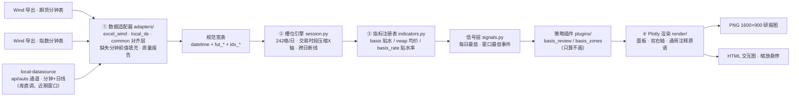
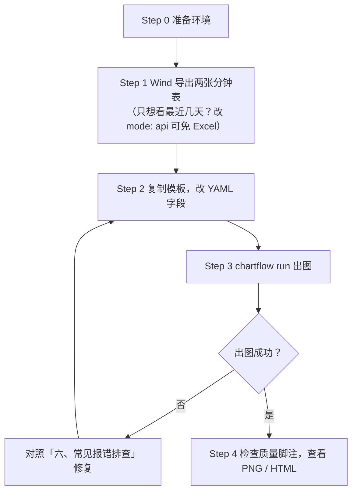

# quant-chart

**YAML 驱动的行情图工作流**：准备好数据两表、改几行配置，一条命令产出研报级行情图（PNG）和可缩放交互图（HTML）。内置中证1000股指期货贴水监控两套预设，贴水、击球区、买卖观察窗等要素开箱即用。


---

## 一、架构介绍

### 1.1 四段流水线



### 1.2 三层配置理念：改需求只动对应的层

| 你想改什么 | 动哪里 | 举例 |
|---|---|---|
| 数据（换合约、换区间） | `input` | 换两个 Excel 路径、改 `range` |
| 计算（策略参数、击球区、触发线） | `strategy` + `params` | 改 `trigger: 250`、增删 `zones` |
| 外观（画什么线、什么颜色） | `panels.layers` | 一般不用动，插件已给默认图层 |

90% 的日常需求只动前两层，不用碰任何代码。

### 1.3 目录结构

```
quant-chart/
├── configs/               # 配置模板（复制一份改成你的）
├── src/quantchart/
│   ├── adapters/          # ① 数据适配（Wind Excel / local-datasource）
│   ├── core/              # ②③ 槽位引擎 / 指标 / 信号 / 插件注册 / 流水线
│   ├── render/            # ④ Plotly 原语翻译与面板组装
│   └── plugins/           # 策略插件（basis_review / basis_zones）
├── tests/                 # 单测 + 真实数据回归
└── docs/                  # 设计文档 / 实施计划 / 图片
```

---

## 二、操作手册（从零到出图）

### 操作流程总览



### Step 0：准备环境

- Python ≥ 3.12
- 本机装有 **Chrome 浏览器**（kaleido 静态出图依赖它）
- 安装本包（在仓库根目录）：

```bash
pip install -e ".[dev]"
```

验证：`chartflow --help` 能打印帮助即安装成功。

### Step 1：准备数据（两张 Excel）

从 Wind 导出**两张分钟级 Excel**，一张期货、一张现货指数（只想看最近几天、手头没有 Excel？见速查表 `mode: api` 行）。要求：

| 要求 | 说明 |
|---|---|
| 列名（10 列，顺序不限） | `代码, 名称, 日期, 开盘价(元), 最高价(元), 最低价(元), 收盘价(元), 涨跌幅, 成交额(百万), 成交量(股)` |
| 粒度 | 每行一个分钟；交易时段内的分钟（午休、周末本来就没有） |
| 时间覆盖 | 两张表都覆盖你要分析的日期区间 |
| 脚注行 | 末尾的“数据来源：Wind”行**允许存在**，程序自动剔除 |
| 缺失分钟 | 个别分钟缺失没关系，程序自动**前值填充**，并在图脚注报告填充数量 |

> 示例数据即 `E:/LLMproject/PersonalAffairs/Backset/` 下的 `IM2612.CFE原始.xlsx`（期货）与 `000852.SH.xlsx`（指数），可参照其格式。

### Step 2：复制模板，改 YAML

```bash
mkdir my
cp configs/basis_zones.yaml my/first.yaml
```

打开 `my/first.yaml`，按下表逐字段修改（模板里的路径是示例，务必替换成你自己的）：

| 字段 | 必填 | 含义 | 示例值 |
|---|---|---|---|
| `input.mode` | 是 | 数据模式：`excel`=Wind 两表（任意历史深度）；`api`=local-datasource（期货分钟约 4 个交易日、指数约 8 个，需已安装）；`auto`=API 优先、覆盖不足自动整体改用 Excel（需同时配 `input.api` 与 `input.excel`，脚注标注降级） | `excel` |
| `input.excel.future` | mode=excel/auto | 期货分钟表路径。Windows 路径请用正斜杠 `/` | `E:/data/IM2612.CFE原始.xlsx` |
| `input.excel.index` | mode=excel/auto | 指数（现货）分钟表路径 | `E:/data/000852.SH.xlsx` |
| `input.api.future` / `input.api.index` | mode=api/auto | 期货与指数代码（经 local-datasource 取数） | `IM2612` / `000852` |
| `input.range` | 是 | 分析区间 `[起始日, 结束日]`，闭区间；api/auto 模式还用它做分钟深度校验 | `[2026-08-17, 2026-08-27]` |
| `strategy` | 是 | 策略预设：`basis_review`=纯行情+贴水+每日最低；`basis_zones`=再加击球区/触发线/低点价差标注 | `basis_zones` |
| `title` | 否 | 图表标题（也可用命令行 `--title` 覆盖） | `"IM2612 行情与贴水"` |
| `params.trigger` | zones 用 | 贴水触发线数值（点），画在击球区内 | `250` |
| `params.zones[].from / to` | zones 用 | 击球区起止时间 `"YYYY-MM-DD HH:MM"`，**必须落在数据区间内的交易时段** | `"2026-08-19 11:30"` |
| `params.zones[].price` | zones 用 | 击球区价格带 `[下沿, 上沿]`（点） | `[7200, 7300]` |
| `params.zones[].label` | zones 用 | 击球区标签文字，显示在框内底部 | `"击球区Ⅰ"` |
| `trades` / `trades_csv` | 否 | 手填交易明细列表（或 CSV 路径，二选一）。每条 `{time, action, lots, price?}`，action ∈ buy/sell/close，close 的 lots 写 `all`；缺 price 用该分钟收盘价。配置后自动在主图标注买卖点（买▲红/卖▼绿/平×灰）并在数据中生成仓位 | `[{time: "2026-08-21 09:39", action: buy, lots: 1}]` |
| `contract_mult` | 否 | 合约乘数，用于 `position_value`（手数×乘数×价） | `200` |
| `extra_panels` | 否 | 在默认面板后**追加**面板（`panels` 是整体替换，两者可并用）。可选键 `y_title`（轴标题）、`range_cols`（按哪些列定 Y 轴范围） | 见 `configs/basis_zones_position.yaml` 仓位面板 |

### Step 3：一条命令出图

```bash
chartflow run my/first.yaml -o out.png --html out.html
```

| 选项 | 说明 |
|---|---|
| `-o, --output` | 输出 PNG 路径（默认 `out.png`，固定 1600×900；目录不存在会自动创建） |
| `--html` | 同时输出交互 HTML 的路径（不给则不出 HTML） |
| `--title` | 覆盖 YAML 里的 `title` |

成功时控制台输出（最后一行是数据质量脚注，也会印在图的底部）：

```
PNG  -> out.png
HTML -> out.html
数据来源:Wind Excel；交易日9天/分钟槽位2178个，期货前值填充6分钟，指数前值填充18分钟。
```

### Step 4：查看结果

- **PNG**：白底研报风格，直接插入报告/聊天工具。
- **HTML**：双击用浏览器打开，可**拖框缩放**看分钟细节、**悬停**查任意分钟的数值。注意 HTML 依赖 Plotly CDN，**需联网**首次加载。

---

## 三、图例说明


| 编号 | 要素 | 含义 | 来自哪里 |
|---|---|---|---|
| ① | 分钟收盘价线（深蓝实线） | 期货每分钟收盘价，左轴 | 插件默认图层 |
| ② | 日内均价线（橙色虚线） | 当日累计成交额÷累计成交量，每日重置 | 插件默认图层 |
| ③ | 贴水面积（红/绿，右轴） | 贴水=现货−期货；红=贴水、绿=升水；右侧外轴为贴水率% | 插件默认图层 |
| ④ | 每日贴水最低倒三角 | 每个交易日的贴水最低点数值；**黑色**=当日曾触及触发线 | 插件默认图层 |
| ⑤ | 击球区矩形 | 买入观察窗（时间×价格带） | `params.zones` |
| ⑥ | 区内触发线（墨绿虚线） | 贴水=trigger 的参考线，只画在击球区内 | `params.trigger` |
| ⑦ | 现价基准线（灰虚线） | 区间最后一分钟收盘价，横贯全图 | 插件默认图层 |
| ⑧ | 低点连线+价差标注（紫） | 击球区窗口内各交易日最低价，虚线连到现价线，标注“距末日收盘价 +价差（+涨幅%）” | `params.zones` |
| ⑨ | 日期行 | 每个交易日的日期，置于时间刻度下方独立一行 | 引擎自动 |
| ⑩ | 右侧双轴 | 贴水（点）与贴水率（%） | 引擎自动 |
| ⑪ | 仓位阶梯线（下面板）与买卖点标记 | 下面板净持仓阶梯（0→1→2→0，hv 阶梯）；主图买▲红/卖▼绿/平×灰标在成交分钟 | 顶层 `trades` + `extra_panels`（示例 `configs/basis_zones_position.yaml`） |

X 轴只含实际交易时段（09:30–11:30、13:00–15:00），午休与跨日间隙自动压缩、跨日不连线。

---

## 四、数据来源

### 4.1 两条数据通道

| 通道 | 深度 | 适用 |
|---|---|---|
| **Excel（Wind 导出）** | 任意历史 | 主通道：任意区间分析、离线可用 |
| **local-datasource** | 期货分钟约 4 个交易日（新浪源）、指数分钟约 8 个（腾讯源），按实际数据动态判定 | 近期窗口快速看图；`auto` 模式下覆盖不足自动整体改用 Excel |

背景实测（2026-08，直连免费接口的分钟深度天花板，local-datasource 封装后同理）：新浪期货分钟约 4 个交易日、腾讯指数分钟约 8 个、东财 push2his 当时整域拒绝、通达信 pytdx 不可用（乱码/停服）。**分钟级长历史免费源无解，深度靠 Excel 补。**

### 4.2 local-datasource 接入（已交付）

分钟与日线统一经 [local-datasource](https://github.com/jarvislee90s-dot/local-datasource)（本机数据服务仓，库直调、CSV 读回，消费契约 v1.1），`mode: api` / `mode: auto` 均可用：

- `api`：只走 local-datasource；请求区间早于源覆盖（期货分钟约 4 个交易日、指数约 8 个，深度按实际数据动态判定）时明确报错并给补数指引，绝不静默降级
- `auto`：API 优先；覆盖不足时自动整体改用已配置的 Excel，脚注标注「API自X日始，已整体改用Excel」
- Excel 通道职责：补 API 覆盖不到的历史区间（任意深度）
- 版本锁定：联调基线 commit `d106144`（建议 `pip install -e` 于固定提交）

---

## 五、常见改法速查

| 想做什么 | 改哪里 |
|---|---|
| 换分析区间 | `input.range` 两行日期 + `title` 里的日期 |
| 换合约 / 换指数 | `input.excel.future` 与 `input.excel.index` 两个路径 |
| 调整击球区窗口或价格带 | `params.zones` 的 `from`/`to`/`price` |
| 增删击球区 | `params.zones` 列表增删条目（每个区自动带触发线与低点标注） |
| 不要击球区，只看行情+贴水 | `strategy: basis_review`，删掉 `params` 段 |
| 改贴水触发线 | `params.trigger` |
| 只看最近几天（手头没有 Excel） | `mode: api` + `input.api` 两行代码 |
| 只改标题 | `title` 或命令行 `--title` |
| 想看自己的仓位 | 顶层写 `trades` + `extra_panels` 仓位面板（完整示例 `configs/basis_zones_position.yaml`） |

## 五之二、深色策略图（日线/日内）

`strategy: daily_candle` 产出深色研报蜡烛图：红涨青跌 K 线 + 均线 + 通道与声明式标注，槽位引擎按「每交易日根数」自适应日线与日内。数据输入有两条通道：

| 通道 | `input.mode` | 必填 | 适用 |
|---|---|---|---|
| 通用条形 CSV | `daily_csv` | `input.csv` | 日线 / 15分钟 / 30分钟 / 60分钟均可；列名中英兼容，按 datetime 排序去重 |
| local-datasource | `daily_api` | `input.api.symbol`（如 `IM0`/`CU0`/`TL0`） | 库直调取条形数据，免手工导出 |

两者都必填 `input.range: [起始日, 结束日]` 闭区间。出图命令与一期相同：`chartflow run configs/daily_candle.yaml -o out/daily.png --html out/daily.html`。

### 周期三参数

| 参数 | 默认 | 作用 |
|---|---|---|
| `input.granularity` | `auto` | 周期：`auto` 按数据推断每交易日根数并回显在脚注；也可显式指定 `day`/`week`/`month`/`15min`/`30min`/`60min`，与推断值偏差超 ±15% 直接报错（周期错了整张图就错，不允许静默） |
| `input.tick_anchor` | `"10:30"` | 日内图每日刻度锚定时刻：锚定该日此时刻那根 bar 标日期；该时刻缺失退回日首根只标日期 |
| `input.strict_range` | `false` | `true` 时数据覆盖不足（请求起点早于实际覆盖）直接报错；默认只在脚注提示「数据自X日始，请求起点Y早于覆盖」 |

### 通道与标注：只声明，不算数

- **`params.channels` 自动拟合**：每条通道只写 `{start, end, color, dash}`（窗口+样式），上下两轨由 `fit_channel` 自动拟合——中枢主导三步法：中枢LSQ定角度位置→小角度倾斜→张合压摆动极值。
- **`params.channels` / `params.annotations` 都在 `params` 段下**。`annotations` 共 8 类，定位一律写「x + 价」：x 可以是日期字符串（须在数据中，否则报错）或 pos 数值（bar 槽位序号，预演区可超出数据末根）。

| type | 关键参数 | 示例 |
|---|---|---|
| `hline` | `value`、color、width、dash | `{type: hline, value: 6999.8, color: "#e47b7c", width: 1.0, dash: solid}` |
| `zone` | `from`/`to`、`price`（[下沿, 上沿]）、edgecolor、fillcolor、dash、opacity、label | `{type: zone, from: "2026-08-05 09:45", to: "2026-08-12 15:00", price: [7300, 7430], edgecolor: "#ff0000", fillcolor: "rgba(0,0,0,0)", opacity: .85}` |
| `circle` | `at`（[x, 价]）、size、color、label（序号文字） | `{type: circle, at: ["2026-08-11 13:45", 7560], color: "#eeef4e", size: 20, label: "1"}` |
| `arrow` | `from`/`to`（[x, 价]，箭头指向 to）、color、width、text | `{type: arrow, from: [514.0, 6999.8], to: [514.0, 7560.0], color: "#f21010", width: 3.2}` |
| `trendline` | `from`/`to`（[x, 价]）、color、width、dash、label | `{type: trendline, from: [1022.0, 7456.8], to: [1038.0, 7380.0], color: "#f04a4a", width: 2.2}` |
| `text` | `at`（[x, 价]）、`text`、size、color、bgcolor | `{type: text, at: [470.0, 7240], text: "区间宽度560点", size: 12, color: "#f21010"}` |
| `tag` | `value`（价）、`text`、color（底色）、text_color（字色）；固定挂在图右缘 | `{type: tag, value: 7560.0, text: "7560", color: "#8c4210", text_color: "#f0e0c0"}` |
| `channel` | `from`/`to`（中枢端点 [x, 价]）、lower/upper（下探/上张，可不对称；或 `width` 等宽）、color、dash、line_width、label | `{type: channel, from: ["2026-07-22", 7000], to: ["2026-08-26", 7500], lower: 80, upper: 120, color: "#39d353", dash: dash}` |

非法 type / 缺参数会以中文报错定位到条目序号。

### 出图自检 CLI（三层验收）

出图后可对「配置 + 成品图」跑机器断言的验收清单——L1 要素齐备 / L2 相对位置 / L3 数学+渲染保真，清单以 python 函数形式随测试交付：

```bash
.venv/bin/python tools/verify_chart.py configs/chart_01_xau.yaml out/chart_01_xau.png --checks tests/acceptance_checks/chart_01.py
```

通过时输出「验收通过: …（0 违规）」。三张样张复刻各配一份成品清单：`tests/acceptance_checks/chart_0{1,2,3}.py`（伦敦金 / 沪铜 / 国债）。

### 读图证据约定（`out/refs/`）

复刻样张定数值时，关键读数（药丸价格、高低点价签、通道走向等）一律放大截图留证于 `out/refs/<图名>/`，坐标标定依据与逐字确认结论写在对应配置文件头部注释——后续改数可追溯、可复核。

### 最小 YAML 示例（摘自 configs/daily_candle.yaml 头部）

```yaml
input:
  mode: daily_csv
  csv: data/IM2612_15min.csv
  range: [2026-06-01, 2026-08-28]
strategy: daily_candle
title: "IM2612 合约 · 15分钟策略同款复刻（样板）"
params:
  ma: [5, 10, 20, 30, 60]
  channels:
    - {start: "2026-07-27 09:45", end: "2026-08-18 15:00", color: "#fdfd52", dash: dash}
  annotations:
    - {type: hline, value: 6999.8, color: "#e47b7c", width: 1.0, dash: solid}
    - {type: zone, from: "2026-08-05 09:45", to: "2026-08-12 15:00", price: [7300, 7430], edgecolor: "#ff0000", fillcolor: "rgba(0,0,0,0)", opacity: .85}
    - {type: tag, value: 7560.0, text: "7560", color: "#8c4210", text_color: "#f0e0c0"}
```

## 六、常见报错排查

| 报错（节选） | 原因 | 解决 |
|---|---|---|
| `缺少必填字段: input` / `缺少必填字段: strategy` | YAML 顶层缺字段 | 按报错补上对应字段 |
| `input.mode=excel 需要 input.excel.future 与 input.excel.index 两表路径（缺失: input.excel.index）` | excel 段缺表路径 | 按括号里的字段路径补齐 |
| `未安装 local-datasource…或改用 mode: excel` | `mode=api/auto` 但本机未安装 local-datasource | `pip install -e <其仓库路径>` 或改 `excel` |
| `分钟数据自 X 日始…请从 Wind 导出 Excel 提供补数` | api 模式请求区间早于源覆盖（期货约 4 个交易日、指数约 8 个） | 更早历史改用 `mode: excel`；`auto` 模式会自动整体改用已配置的 Excel 并在脚注标注 |
| `FileNotFoundError: ...xlsx` | Excel 路径不对 | 检查路径，Windows 用正斜杠 `/` |
| `时间点不在数据中: 2026-08-22 13:00` | `zones` 的 from/to 写在非交易日、非交易时段或数据区间外 | 改成区间内实际存在的交易分钟 |
| kaleido / Chrome 相关报错 | 静态导出缺 Chrome | 安装 Chrome 后重试 |
| 脚注“前值填充N分钟” | 数据里个别分钟缺失，已自动用前值填充 | 无需处理；若 N 异常大，检查 Wind 导出是否断档 |

## 七、进阶：写一个新策略插件

`src/quantchart/plugins/` 下新建文件：

```python
from ..core.indicators import apply_indicators
from ..core.plugins import StrategyOutput, register_strategy

@register_strategy("my_strategy")
def run(df, slots, **params):
    df = apply_indicators(df, [{"name": "basis"}])   # 加指标列
    events = []                                       # 可选：产出事件点
    panels = [{"title": "主图", "layers": [...]}]     # 默认图层（YAML 可覆盖）
    return StrategyOutput(df=df, events=events, panels=panels)
```

铁律：**插件只算不画**——不 import plotly，视觉一律交给 `panels.layers` 里的通用原语（line/area/zone/hline/events/leader_tag/day_seps/day_labels）。详见[设计文档](docs/superpowers/specs/2026-08-27-quant-chart-design.md)。

## 八、开发与文档

```bash
pytest -q                          # 全部测试（夹具自动生成，克隆即跑）
pytest tests/test_regression.py -q # 真实数据回归（默认读 Backset 目录，可用 QUANT_CHART_TEST_DATA 改指）
```

- [设计文档](docs/superpowers/specs/2026-08-27-quant-chart-design.md) · [实施计划](docs/superpowers/plans/2026-08-27-quant-chart-mvp.md) · [偏差与已知问题 DEVIATIONS.md](DEVIATIONS.md)
- 三期候选（DEVIATIONS 在案）：规则生成器（条件→仓位模拟） · API+Excel 区间拼接 · 期权/ETF 品类 · 回测联动
- 效果图更新：改图后运行 `python tools/annotate_readme_fig.py` 重新生成图例标注版
