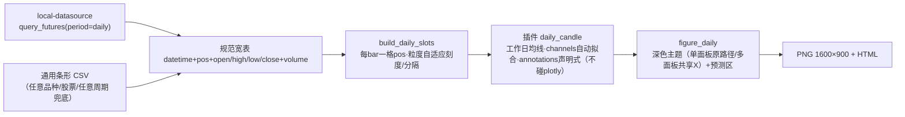

# 深色蜡烛图产品线 · 第一篇：通用作图能力 设计文档

> 日期：2026-08-28（2026-08-29 自原两期合订 spec 拆分独立）· 状态：一期已交付
> 参考样张：`reference/01–05`（自《集群投研报告004期》导出）· 上游设计：`2026-08-27-quant-chart-design.md`
> 姊妹文档：《剩余三图复刻设计文档（二期）》——"具体三张图怎么画"见该文档，本文只定义通用作图能力。

## 1. 背景与定位

quant-chart 原生能力是**分钟级中证1000贴水监控图**（basis_review / basis_zones 两预设）。本能力在其旁路新增一类通用作图功能：**研报深色策略蜡烛图**——深色底、日线/日内（15/30/60 分钟）条形、蜡烛+均线+支撑压力+趋势通道+彩色标注，一条 YAML 命令产出 PNG/HTML。

定位三条边界：

- **通用**：不绑定具体品种/合约，任何日线/日内 OHLCV 数据都能出图；
- **旁路**：`input.mode` 以 `daily_` 开头即走独立管线，分钟贴水路径行为与测试零改动；
- **风格同款优先**：以参考样张目视一致为验收口径，不追逐逐点一致。

## 2. 架构与原则

1. **旁路原则**：`run_pipeline` 对 `daily_*` 前缀配置转投 `run_daily_pipeline`，复用插件注册表/panels 合并/events 接线；CLI 零改动。
2. **分层不变**：插件只算不画（不 import plotly）；视觉一律经通用原语翻译；「数据/计算/外观」三层配置理念延续；错误信息中文定位到字段路径/条目序号。
3. **单面板约束**：日线图暂只支持单面板，多面板明确报错。（~~已解除~~：2026-08-31 task2 解除该红线，多面板接入与日内同一机制，见 §9 增补）

## 3. 功能需求

### FR-1 数据通道（两条）

| mode | 来源 | 要求 |
|---|---|---|
| `daily_api` | local-datasource `query_futures(period="daily")` 库直调+CSV读回（基线 d106144） | 未安装给安装指引并提示改用 `daily_csv`，绝不静默降级 |
| `daily_csv` | 通用条形 CSV | 列名中英兼容；**周期不限**（日线/15分钟/30分钟/60分钟均可，按 datetime 排序去重） |

- 关键函数：`load_daily(input_cfg) -> (DataFrame, DailyQualityReport)`；宽表列规范 `datetime, open, high, low, close`，**volume 可选**（无量品种如伦敦金自动省略，脚注标注"无量"）
- **周期显式参数化**：`input.granularity: auto(默认)/day/week/month/15min/30min/60min`——auto 按数据推断每交易日根数并回显；显式指定则与推断值校验，偏差超 ±15% 直接报错（周期错了整张图就错了，不允许静默）。周期根数表 `GRANULARITY_BPD` 收敛在 config.py
- **数据覆盖校验**：请求起点早于数据实际覆盖时**不得静默截短**——脚注强制标注"数据自X日始，请求起点Y早于覆盖"；`input.strict_range: true` 时直接报错
- 错误处理：未安装/缺文件/缺列/重复日期/区间内无数据，中文报错定位来源

### FR-2 条形槽位（粒度自适应）

- 关键函数：`build_daily_slots(df) -> Slots`（复用现有结构，分钟引擎不改）
- 行为：每 bar 一格 `pos=0..n-1` 连续；非交易时段自然压缩
- 日线（每日一根）：月界分隔、月/周自适应刻度
- 日内多根/日：日界分隔、按日抽样刻度（约 12 个标签），**锚定该日 tick_anchor 时刻那根 bar**（`input.tick_anchor`，默认 "10:30"，同原报告画法；该时刻缺失退回日首根只标日期——适配不同市场时段）

### FR-3 渲染原语（8 类）

全部走 pos 数值轴与 `Ctx`，日期字符串经 `_xof` 解析；只翻译、不算数。

| type | 职责 | 关键参数 |
|---|---|---|
| `candle` | 深色底蜡烛，涨跌色可配 | open/high/low/close 列名、up/down 色 |
| `trendline` | 任意两点线段（趋势线/通道边线/折线段） | `from`/`to`=`[日期,价]`、dash、color、width、label |
| `arrow` | 带箭头引线（区间宽度/支撑提示） | `from`/`to`、color、width、text |
| `tag` | 右缘彩色药丸标签（价格/BULL/BEAR/BASE） | value、text、底色/字色 |
| `circle` | 关键点圆圈标记（可带序号） | `at`、size、color、label |
| `text` | 自由彩字标注 | `at`、text、size、color |
| `hline` | 水平支撑/压力/分界线 | value、color、dash、label（axis 由插件注入主轴） |
| `zone` | 时间×价格矩形（观察区/集合区） | `from`/`to`、price、edgecolor、fillcolor、dash、opacity、label |
| `channel` | **平行通道一条声明**：中枢端点 + 下探/上张量 → 画出上下两条平行轨（严格平行、可不对称），可选 label | `from`/`to`、lower/upper（或 width 等宽）、color、dash、line_width、label |

### FR-4 深色主题图组装

- 关键函数：`build_daily_figure(df, slots, panels, rep, title) -> go.Figure`
- 布局契约：深底浅网格（色值集中 `theme.DARK`，原语缺省色一律引用常量防漂移，测试以哨兵色守护）；右缘留白容纳 tag 药丸；xaxis 右界 = `n_all + FORECAST_DAYS × bars_per_day + 1.5`（`FORECAST_DAYS = 2`，为三情形预演折线腾出预测区；日线图退化为 +2 格）；标题/脚注 annotation，脚注为条形数据口径
- **脚注回显（出图前自检清单）**：数据来源、交易日数、**每交易日根数与周期标签**、周期自动推断值、**pos 锚点标注计数**（换数据需重校的隐患显性化）、覆盖提示、**预测区单位换算**（"N 工作日 ≈ M 根"）——控制台与成品图同源可见
- **渲染可见性守卫（内置）**：出图后扫描全部数据坐标元素（traces/annotations 含箭尾/shapes），超出 xaxis 范围即在脚注追加"⚠ 渲染可见性警告"——Plotly 对超界元素静默裁剪（第二批次的 Critical 坑），守卫内置后不再依赖每份验收清单复制

### FR-5 策略插件 daily_candle

- 签名：`run(df, slots, ma=[5,10,20,30,60], ma_unit="day", annotations=None, channels=None, **params)`
- **均线默认按工作日换算**：`bars_per_day = len(df)/唯一日期数`；频率高于日线时窗口 = `n × bars_per_day`（15 分钟下 [5,10,20,30,60] → [80,160,320,480,960] 根，即 5/10/20/30/60 个工作日）；`ma_unit: "bar"` 特别约定按根数；窗口 ≤ 数据长度时画 partial 末段（不静默截断，如 ma60 仅末段）；**窗口 > 数据长度时该 MA 不画**（图层移除、图例同步消失）+ 脚注回显「MA 窗口超出数据长度（N根），未绘制」——与 TradingView/通达信「窗口不足不画不报错」一致，不阻断整图（backlog #23，见 §9.6）
- **channels 自动拟合**：每条 `{start, end, tilt, press, color, dash, label}` → 调 `fit_channel` 产出通道图层（中枢端点+下探/上张量）
- **事件式锚定**：start/end 除日期字符串外支持规则式——`{peak/trough: true}`（窗口最高/最低价那根 bar）、`{above/below: 价, after?: 起始日}`（该价位首破事件）；解析结果回显脚注，无命中/非法规则中文报错——通道起止绑定业务事件，数据刷新自动重锚，杜绝硬编码日期漂移
- **annotations**：声明式标注列表（FR-3 各类型），插件逐条校验（未知 type/缺参数 → 中文报错定位条目序号）
- `trades` 不支持于日线模式：配置了明确报错，接口保留

### FR-6 YAML 配置与校验

- 模板随一期交付：`configs/daily_candle.yaml`（数据段 + ma + channels + annotations 全要素示例）
- 校验：`daily_api` 必填 `input.api.symbol`；`daily_csv` 必填 `input.csv`；两者必填 `input.range` 闭区间；`input.granularity` ∈ auto/day/week/month/15min/30min/60min；`input.strict_range` 布尔；`input.tick_anchor` "HH:MM" 格式；`annotations` 为映射列表；`channels` 条目必含 `start/end`

### FR-7 流水线路由

`run_daily_pipeline(cfg)`：`daily_*` 前缀路由；流程 = 载入 → 日线槽位 → 插件 → panels 合并 → events 接线 → `build_daily_figure`；保证图层数据帧与 y 轴范围计算用同一 df 对象。CLI 命令与输出行为与既有完全一致。

## 4. 数据可用性实测记录（2026-08-28）

| 品种/周期 | 通道 | 结果 |
|---|---|---|
| IM0 主连日线 | local-datasource @d106144 | ✅ 64 交易日，覆盖样板区间 |
| IM2612 合约 15 分钟 | akshare 新浪源 | ✅ 1023 根（64 交易日×16），2026-06-01→08-28 |
| XAU 伦敦金现货日线 | akshare `futures_foreign_hist` | ✅ 5186 交易日（2006→当日），无量 |
| CU0 / TL0 日线 | 同期货接口 | 二期使用，机制通用 |

## 5. 出图自检（qa.verify，三层机器验收）

出图自检是**通用能力**：`quantchart.qa.verify::Verifier(fig, df)` 对成品 fig 做三层机器断言，另配 CLI `tools/verify_chart.py`。

- **L1 要素层**：蜡烛涨跌色、通道轨数、水平线数量、文字在场（按颜色/文字子串定位）；
- **L2 相对位置层**：标记落在锚点 ±tol、预测区元素整体位于最后 K 线右侧、元素位于图幅左四分之一区/预测区（`expect_in_left_quarter`/`expect_in_forecast_zone`，按 n_all 动态计算）；
- **L3 数学关系层**：双轨平行（±1e-6）、下轨压住指定低点带（`expect_lower_wraps`）、上轨压住指定高点带（`expect_upper_wraps`）、价差标注 == 跨线差值（±tol）、MA 末值 == rolling 末值（±1e-6）；
- **R 渲染保真**：fig 通道轨坐标 == `fit_channel` 重算输出（±tol）——防"算出来的对、画出来的错"（第一批次 447 点偏移教训）。

每图一份验收清单（`tests/acceptance_checks/<图>.py` 的 `run(fig, df, rep, cfg) -> Verifier`），由 `tests/test_acceptance_charts.py` parametrize 装载（CSV 缺席自动 skip）。任何一条违规即图不可交付。

## 5b. 出图前参数确认清单（交互约定）

作图前若以下参数未明确，先向用户确认、不猜测（CLI 层对应"推断回显+矛盾报错"）：

| # | 参数 | 缺省行为 |
|---|---|---|
| 1 | 数据来源与品种代码（或 CSV 路径） | 必须提供 |
| 2 | **周期**（日/60/30/15 分钟…） | 数据推断但必须回显确认（granularity 显式则校验） |
| 3 | 时间窗口（起止） | 必须提供；早于覆盖时脚注/报错 |
| 4 | 关键位阶（支撑/压力/目标位） | 可选，提取后回显 |
| 5 | 输出（PNG/HTML 路径、对照图） | 有默认值 |

## 6. 已知暂缓事项

探索中发现、暂不实现的问题统一登记在 `docs/backlog/README.md`（如通道自动分段器、R 检查带状灵敏度等）——触发条件成熟后再立项。

## 7. 一期验收（已达成）

1. `pytest -q` 全绿，既有分钟测试零修改零失败；
2. `chartflow run configs/daily_candle.yaml -o out/daily_candle_IM.png --html out/daily_candle_IM.html` 成功，脚注条形口径；
3. 与 `reference/05_IM2612合约.png` 并排目视：深色蜡烛红涨青跌、工作日均线×5、三条水平支撑压力线（6460.9/6999.8/7560）+右缘药丸、黄/绿双通道、区间宽度箭头（560/539 点）、①②③④圆圈、BULL/BEAR/BASE 走势预演、大字标注、高低点价签；
4. 换品种/换周期仅改 YAML，零代码改动。

## 8. 已知限制与后续

- 免费源 15 分钟深度约 1023 根（≈64 交易日），更长窗口需 Wind 导出 Excel 补数；
- ~~XAU 无量：volume 可选语义未实现（二期前置任务）~~——已实现（2026-08-31 task2）：
  适配器 volume 列缺失即丢列+脚注"无量"，量图层自动省略（见 §9 增补）；
- 主连/合约拼接口径与原报告制作口径可能不同，以风格同款为验收；
- `CSV(…)` 数据来源前缀对日内周期不严谨，随通道语义升级一并处理；
- 模板标注坐标与具体数据绑定，换数据需按 fit_channel 重新校准（约定：优先日期锚点，pos 仅用于右缘画布外元素）。
## 9. 增补（2026-08-31，task2）：多面板与成交量子图接口约定

### 9.1 多面板：与日内 extra_panels 同一机制（接入统一，不另立体系）

- 配置面：顶层 `panels`（整体替换）/ `extra_panels`（追加）/ `row_heights`（每行高度占比，
  默认主图 0.72、其余平分 0.28）三个键跨日线/日内同效；`merge_panels` 优先级不变
  （panels > extra_panels > 插件默认）。
- 渲染面：`build_daily_figure` 按面板数分派——N==1 走 `_build_daily_single`（原路径，
  回归测试钉死逐字节不变）；N>1 走 `_build_daily_multi`（`make_subplots(shared_xaxes=True)`，
  与日内 `_build_multi` 同构：主图保留右缘预测区、时间刻度只画最底面板、逐面板纵轴
  按 `range_cols` 或层内 line/volume 列自适应）。
- 轴重映射 `_remap_daily_axes`：面板≥2 时，原语缺省轴（area/hline/events 默认 y2）与字面
  `axis: "y"` 注入本面板主轴；日线无贴水 overlay，比日内少一层 y2→overlay 重定向。
- 可见性守卫与脚注装配抽为 `_visibility_warnings`/`_annotate`，单/多面板共用
  （多面板共享 X，统一对顶轴范围校验）。

### 9.2 成交量子图（volume 原语 + params.volume_panel）

- 数据口径：适配器 `volume` 列（CSV `成交量`/`volume`，中英表头已映射）；无量品种
  （如伦敦金现货）适配器丢列且脚注"无量"，量图层自动省略、不画空面板。
- 原语 `_volume`：Bar 柱，红涨青跌与 K 线同色语义（缺省取 `theme.DARK["up"]/["down"]`，
  可配 `up/down/opacity/width` 覆盖）；x=pos 数值轴，多面板 shared_xaxes 逐柱对齐；
  列缺失/全 NaN 自动省略。
- 一键声明：`params.volume_panel: true` 由 daily_candle 插件追加预置面板
  （`{title: 成交量, y_title: 成交量, range_cols: [volume], layers: [{type: volume}]}`），
  与手写 `extra_panels` 等价二选一；量柱面板纵轴下限锁 0（`_panel_range(zero_floor=True)`）。

### 9.3 配套修复（P2#3 / P2#4，详见 DEVIATIONS.md「Task2 偏差记录」）

- P2#3：`_hline` 线体与标注共用 xref，消除死赋值；"只给 to 不给 from"标注不再错位。
- P2#4：贴水副轴刻度改数据自适应——遗留包络（b0≥-15、b1≤400、rate≤5.55）内保持历史
  范围/刻度零变化，包络外按 `_nice_step` 整齐生成、下限随数据下扩，不再裁切。
- 连带：`qa/verify._by_color` 跳过无 `.line` 的 trace（Bar 量柱入图后 AttributeError）。

### 9.4 验收

- 新增 `tests/acceptance_checks/daily_volume.py`（三层清单）+ 登记
  `test_acceptance_charts` 第 4 图 `daily_volume_demo`（CSV `examples/` 随仓，任何环境可跑）；
- 示例：`configs/daily_volume_demo.yaml`（合成数据 `tools/make_demo_daily.py`，种子
  20260831 可复现），成品 `out/projects/daily_volume_demo/chart.png`；
- 口径：`pytest -q -m "not integration_localds"` 160 passed / 0 failed（基线 138+1failed
  → 138 不减、预存失败修复）；单面板路径快照 0 diff（`daily_single`/`daily_e2e`）。

### 9.5 扩展契约：新增一种子图类型（注册/发现方式）

面板本身是开放结构（`{title, y_title?, range_cols?, zero_floor?, layers: [...]}`），
子图类型 = 绘图原语（`render/primitives.py` 的 `_<type>` 函数），**约定式自动发现**
（`draw()` 按 `f"_{spec['type']}"` getattr 分派，无注册表需要改）。新增一种子图类型：

| 步骤 | 文件 | 改动点 |
|---|---|---|
| 1（唯一必改） | `src/quantchart/render/primitives.py` | 加 `_<type>(fig, spec, ctx)`：从 `ctx.df` 取数列、按 `ctx.xaxis/ctx.yaxis` 绑定本面板轴（`yaxis=None if ctx.yaxis=="y" else ctx.yaxis`） |
| 2（可选） | `src/quantchart/render/figure_daily.py` | 若该类型需 0 基线：面板 `zero_floor: true`（或含量柱层自动）；纵轴取数列缺省已收所有带 `"col"` 的图层，一般无需改 |
| 3（可选） | `src/quantchart/plugins/daily_candle.py` | 若要一键声明参数（如 `volume_panel`），加 params 键与预置面板 |
| 4 | `tests/` | 原语测试 + 面板布局测试 |

约束：新原语须 (a) 经 `ctx.yaxis` 绑定本面板轴（不落主图）；(b) 无量/缺列时省略不崩
（参照 `_volume`：列缺失/全 NaN → return）；(c) 深色主题色值取 `theme.DARK` 不内嵌字面。

### 9.6 MA 窗口超数据长度（backlog #23，追加轮落地）

- 窗口 ≤ 数据长度：画 partial 末段（rolling 天然语义，不静默截断）；
- 窗口 > 数据长度：`rolling(w)` 全 NaN（无可用段），该 MA **不画**——图层移除、
  图例同步消失，脚注回显「MA 窗口超出数据长度（N根），未绘制: MA20（20根）、…」；
- 不选「画可用部分」（须 `min_periods=1`，会把 MA20 算成 5 根均值、篡改语义）；
  不选「报错」（多窗口混合时一个超长窗口毁全图，行情软件从不因此拒绝出图）；
- 配色按 MA 原序号取 `ma_palette`，缺失窗口不挤压其余 MA 配色；
- 回归：窗口内/恰等于/超出/混合/日内换算路径五类（`test_daily_plugin.py`）
  + e2e 脚注（`test_daily_pipeline.py::test_ma_overflow_footnote_and_no_trace`）。
