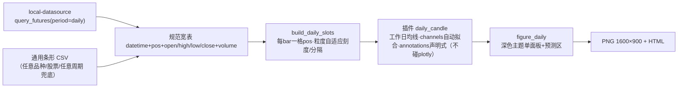

# 深色蜡烛图产品线 · 第一篇：通用作图能力 设计文档

> 日期：2026-08-28（2026-08-29 自原两期合订 spec 拆分独立）· 状态：一期已交付
> 参考样张：`reference/01–05`（自《集群投研报告004期》导出）· 上游设计：`2026-08-27-quant-chart-design.md`
> 姊妹文档：《剩余三图复刻设计文档（二期）》——"具体三张图怎么画"见该文档，本文只定义通用作图能力。

## 1. 背景与定位

quant-chart 原生能力是**分钟级中证1000贴水监控图**（basis_review / basis_zones 两预设）。本能力在其旁路新增一类通用作图功能：**研报深色策略蜡烛图**——深色底、日线/日内（15/30/60 分钟）条形、蜡烛+均线+支撑压力+趋势通道+彩色标注，一条 YAML 命令产出 PNG/HTML。

定位三条边界：

- **通用**：不绑定具体品种/合约，任何日线/日内 OHLCV 数据都能出图；
- **旁路**：`input.mode` 以 `daily_` 开头即走独立管线，分钟贴水路径行为与测试零改动；
- **风格同款优先**：以参考样张目视一致为验收口径，不追逐逐点一致。

## 2. 架构与原则

1. **旁路原则**：`run_pipeline` 对 `daily_*` 前缀配置转投 `run_daily_pipeline`，复用插件注册表/panels 合并/events 接线；CLI 零改动。
2. **分层不变**：插件只算不画（不 import plotly）；视觉一律经通用原语翻译；「数据/计算/外观」三层配置理念延续；错误信息中文定位到字段路径/条目序号。
3. **单面板约束**：日线图暂只支持单面板，多面板明确报错。

## 3. 功能需求

### FR-1 数据通道（两条）

| mode | 来源 | 要求 |
|---|---|---|
| `daily_api` | local-datasource `query_futures(period="daily")` 库直调+CSV读回（基线 d106144） | 未安装给安装指引并提示改用 `daily_csv`，绝不静默降级 |
| `daily_csv` | 通用条形 CSV | 列名中英兼容；**周期不限**（日线/15分钟/30分钟/60分钟均可，按 datetime 排序去重） |

- 关键函数：`load_daily(input_cfg) -> (DataFrame, DailyQualityReport)`；宽表列规范 `datetime, open, high, low, close, volume`
- 错误处理：未安装/缺文件/缺列/重复日期/区间内无数据，中文报错定位来源
- 已知缺口（二期处理）：volume 目前必填，无量品种（XAU）待开放可选

### FR-2 条形槽位（粒度自适应）

- 关键函数：`build_daily_slots(df) -> Slots`（复用现有结构，分钟引擎不改）
- 行为：每 bar 一格 `pos=0..n-1` 连续；非交易时段自然压缩
- 日线（每日一根）：月界分隔、月/周自适应刻度
- 日内多根/日：日界分隔、按日抽样刻度（约 12 个标签），**锚定该日 10:30 那根 bar**，标签格式 `月.日 HH:MM`（同原报告画法）

### FR-3 渲染原语（8 类）

全部走 pos 数值轴与 `Ctx`，日期字符串经 `_xof` 解析；只翻译、不算数。

| type | 职责 | 关键参数 |
|---|---|---|
| `candle` | 深色底蜡烛，涨跌色可配 | open/high/low/close 列名、up/down 色 |
| `trendline` | 任意两点线段（趋势线/通道边线/折线段） | `from`/`to`=`[日期,价]`、dash、color、width、label |
| `arrow` | 带箭头引线（区间宽度/支撑提示） | `from`/`to`、color、width、text |
| `tag` | 右缘彩色药丸标签（价格/BULL/BEAR/BASE） | value、text、底色/字色 |
| `circle` | 关键点圆圈标记（可带序号） | `at`、size、color、label |
| `text` | 自由彩字标注 | `at`、text、size、color |
| `hline` | 水平支撑/压力/分界线 | value、color、dash、label（axis 由插件注入主轴） |
| `zone` | 时间×价格矩形（观察区/集合区） | `from`/`to`、price、edgecolor、fillcolor、dash、opacity、label |
| `channel` | **平行通道一条声明**：中枢端点 + 下探/上张量 → 画出上下两条平行轨（严格平行、可不对称），可选 label | `from`/`to`、lower/upper（或 width 等宽）、color、dash、line_width、label |

### FR-4 深色主题图组装

- 关键函数：`build_daily_figure(df, slots, panels, rep, title) -> go.Figure`
- 布局契约：深底浅网格（色值集中 `theme.DARK`，原语缺省色一律引用常量防漂移）；右缘留白容纳 tag 药丸；xaxis 右界 = `n_all + FORECAST_DAYS × bars_per_day + 1.5`（`FORECAST_DAYS = 2`，为三情形预演折线腾出预测区；日线图退化为 +2 格）；标题/脚注 annotation，脚注为条形数据口径

### FR-5 策略插件 daily_candle

- 签名：`run(df, slots, ma=[5,10,20,30,60], ma_unit="day", annotations=None, channels=None, **params)`
- **均线默认按工作日换算**：`bars_per_day = len(df)/唯一日期数`；频率高于日线时窗口 = `n × bars_per_day`（15 分钟下 [5,10,20,30,60] → [80,160,320,480,960] 根，即 5/10/20/30/60 个工作日）；`ma_unit: "bar"` 特别约定按根数；窗口超出数据长度时画 partial（不静默截断，如 ma60 仅末段）
- **channels 自动拟合**：每条 `{start, end, tilt, press, color, dash, label}` → 调 `fit_channel` 产出通道图层（中枢端点+下探/上张量）
- **annotations**：声明式标注列表（FR-3 各类型），插件逐条校验（未知 type/缺参数 → 中文报错定位条目序号）
- `trades` 不支持于日线模式：配置了明确报错，接口保留

### FR-6 YAML 配置与校验

- 模板随一期交付：`configs/daily_candle.yaml`（数据段 + ma + channels + annotations 全要素示例）
- 校验：`daily_api` 必填 `input.api.symbol`；`daily_csv` 必填 `input.csv`；两者必填 `input.range` 闭区间；`annotations` 为映射列表；`channels` 条目必含 `start/end`

### FR-7 流水线路由

`run_daily_pipeline(cfg)`：`daily_*` 前缀路由；流程 = 载入 → 日线槽位 → 插件 → panels 合并 → events 接线 → `build_daily_figure`；保证图层数据帧与 y 轴范围计算用同一 df 对象。CLI 命令与输出行为与既有完全一致。

## 4. 数据可用性实测记录（2026-08-28）

| 品种/周期 | 通道 | 结果 |
|---|---|---|
| IM0 主连日线 | local-datasource @d106144 | ✅ 64 交易日，覆盖样板区间 |
| IM2612 合约 15 分钟 | akshare 新浪源 | ✅ 1023 根（64 交易日×16），2026-06-01→08-28 |
| XAU 伦敦金现货日线 | akshare `futures_foreign_hist` | ✅ 5186 交易日（2006→当日），无量 |
| CU0 / TL0 日线 | 同期货接口 | 二期使用，机制通用 |

## 5. 一期验收（已达成）

1. `pytest -q` 全绿，既有分钟测试零修改零失败；
2. `chartflow run configs/daily_candle.yaml -o out/daily_candle_IM.png --html out/daily_candle_IM.html` 成功，脚注条形口径；
3. 与 `reference/05_IM2612合约.png` 并排目视：深色蜡烛红涨青跌、工作日均线×5、三条水平支撑压力线（6460.9/6999.8/7560）+右缘药丸、黄/绿双通道、区间宽度箭头（560/539 点）、①②③④圆圈、BULL/BEAR/BASE 走势预演、大字标注、高低点价签；
4. 换品种/换周期仅改 YAML，零代码改动。

## 6. 已知限制与后续

- 免费源 15 分钟深度约 1023 根（≈64 交易日），更长窗口需 Wind 导出 Excel 补数；
- XAU 无量：volume 可选语义未实现（二期前置任务）；
- 主连/合约拼接口径与原报告制作口径可能不同，以风格同款为验收；
- `CSV(…)` 数据来源前缀对日内周期不严谨，随通道语义升级一并处理；
- 模板标注坐标与具体数据绑定，换数据需按 fit_channel 重新校准（约定：优先日期锚点，pos 仅用于右缘画布外元素）。