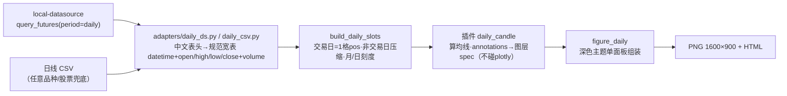

# quant-chart 日线蜡烛图复刻设计文档（研报深色同款）

> 日期：2026-08-28 · 状态：待评审
> 上游文档：`2026-08-27-quant-chart-design.md`（主设计）· 参考：`reference/01–05`（自《集群投研报告004期》导出）

## 1. 背景与目标

《集群投研报告004期》含 5 幅策略图：4 幅**深色底期货日线蜡烛图**（01 伦敦金现货、02 沪铜主力、03 30年国债期货TL、05 IM2612合约）与 1 幅浅色分钟贴水图（04，即本项目 basis_zones 原生产物，**不在本期范围**）。

目标：用 quant-chart 现有机制（YAML → 适配 → 槽位 → 插件 → 原语渲染）复刻 4 幅深色图，**两期交付**：

- **一期（本文详述）**：打通日线旁路全链路，复刻样板图 `reference/05_IM2612合约.png`，产出可复用机制。
- **二期（§11 仅圈范围）**：一期验收通过后，在同一框架内以纯配置复刻 01/02/03，另行出实施计划。

硬约束：分钟主路径（贴水两预设）行为零改动，旧测试零修改。

## 2. 现状摸底结论（2026-08-28 实测）

| 检查项 | 结论 |
|---|---|
| 渲染原语 | 仅 line/area/zone/hline/events/leader_tag/day_seps/day_labels，**无蜡烛** |
| figure.py | 硬编码贴水双右轴、分钟脚注、白底研报风格 |
| 槽位引擎 | `build_slots` 按 242 格/日分钟网格，不适用日线 |
| local_ds 适配 | `adapters/local_ds.py` 写死 `period="min"`，日线未接 |
| local-datasource @d106144 | `pip install -e` 成功（py3.12）；`query_futures(IM0, daily)` 实测返回 64 交易日 ×（日期/开/高/低/收/量/持仓/动态结算价），中文表头 CSV；主连日线深度约 158 交易日（README 载明），覆盖一二期全部区间 |
| 本机环境 | Python 3.12 venv 就绪；kaleido 可导入；Chrome 在位，PNG 导出链路可用 |

## 3. 总体架构：日线旁路



原则：`input.mode` 以 `daily_` 开头即路由到独立日线管线函数（`run_daily_pipeline`），复用插件注册表、panels 合并、events 接线；分钟路径不感知。

## 4. 数据通道（两条，对齐既有 excel/api 双通道理念）

| mode | 来源 | 说明 |
|---|---|---|
| `daily_api` | local-datasource 库直调 `period="daily"` | 新增 `adapters/daily_ds.py`，模式对齐 `local_ds.py`（库直调 + CSV 读回 + 未安装友好报错）；期货主连 `IM0`/`CU0`/`TL0` 自动归一 |
| `daily_csv` | 任意日线 CSV | 列名兼容中（日期/开盘价/最高价/最低价/收盘价/成交量）英（date/open/high/low/close/volume）；离线可用、任意历史 |

校验（config.py）：`daily_api` 必填 `input.api.symbol`；`daily_csv` 必填 `input.csv`；两者均必填 `input.range`（闭区间）。

## 5. 日线槽位 `build_daily_slots`

- 每交易日占一格，`pos = 0..n-1`；非交易日（周末/节假日）自然压缩，与分钟引擎「压缩X轴」同一哲学。
- 复用 `Slots` 结构：`day_span={date:(pos,pos)}`；`sep_center`=月界分隔位；`tick_pos/tick_lab`：区间 >90 交易日按月刻度 `YY-MM`（如 `26-06`），否则按周刻度 `MM-DD`。

## 6. 渲染原语（新增 6 类，复用 2 类）

全部走 `pos` 数值轴与 `Ctx`，日期字符串经 `_xof` 解析；保持「只翻译、不算数」。

| type | 关键参数 | 复刻要素（对照参考图） |
|---|---|---|
| `candle` | open/high/low/close 列名、涨/跌色 | 深色底蜡烛（红涨青跌，目视校准后可调） |
| `trendline` | `from`/`to`=`[日期, 价]`、dash/color/width/label | 上升白实线、黄色下降虚线通道 |
| `arrow` | `from`/`to`（或 from+偏移）、color/text | 红色上行箭头、BULL/BEAR 分叉走势预演 |
| `tag` | value、text、底色/字色 | 右缘药丸标签：价格数字、BULL、BEAR |
| `circle` | `at`=`[日期, 价]`、size/color | 黄色圆圈关键点标记 |
| `text` | `at`、text/size/color | 「IM2612合约」大字、「周线级别下降通道」等彩字 |
| `hline`（复用） | value/color/dash/label | 水平支撑/压力线、多空分界线 |
| `zone`（复用） | from/to/price/edgecolor | 红框「等待观察区」 |

## 7. 深色主题组装 `render/figure_daily.py`

`build_daily_figure(df, slots, panels, rep, title)`：单面板；深底浅网格（色值对照参考图取样）；右缘价格轴与留白（容纳 tag 药丸）；底部 `rep.footnote()` 换日线口径（数据来源 + 交易日 N 天）。主题常量（涨跌色、均线默认色板、底色）集中模块顶部，暂不进 YAML。

## 8. 策略插件 `plugins/daily_candle.py`

- 计算：`params.ma: [5,10,20,30,60]` → `df["ma5"]…`（close 滚动均值）；默认图层 = candle + 均线 × N。
- 标注：`params.annotations:` 声明式列表（§6 的 8 类 type），插件逐条校验并翻译为图层 spec 追加进主面板；**不 import plotly**。
- 复用 `merge_panels`/`_wire_events`；`trades`/`extra_panels` 接口保留，但日线口径的买卖点适配不在一期范围（一期不接 `trades`，配置了将明确报错提示不支持）。

## 9. YAML 模板 `configs/daily_candle.yaml`（一期样板）

```yaml
title: "IM2612 合约（复刻样板）"
input:
  mode: daily_api
  api: {symbol: IM0}
  range: [2026-06-01, 2026-08-28]
strategy: daily_candle
params:
  ma: [5, 10, 20, 30, 60]
  annotations:
    - {type: hline, value: 7650, color: "#ff5b5b", width: 1.2, label: "区间看至7650"}
    - {type: trendline, from: ["2026-06-24", 7050], to: ["2026-08-21", 7560], color: "#e8e8e8"}
    - {type: trendline, from: ["2026-06-24", 7900], to: ["2026-08-28", 7200], color: "#f1c40f", dash: dash}
    - {type: zone, from: "2026-06-24", to: "2026-07-04", price: [7150, 7700], edgecolor: "#ff4136", label: "等待观察区"}
    - {type: circle, at: ["2026-08-21", 7560], color: "#f1c40f"}
    - {type: arrow, from: ["2026-07-20", 6900], to: ["2026-07-20", 7550], color: "#ff4d4f", text: "区间看至7560点"}
    - {type: tag, value: 7560, text: "7560", color: "#ff8c00"}
    - {type: tag, value: 7500, text: BULL, color: "#ff6b81"}
    - {type: tag, value: 7440, text: BEAR, color: "#39d353"}
    - {type: text, at: ["2026-07-10", 7300], text: "IM2612合约", size: 16, color: "#e74c3c"}
```

（标注坐标为示意，实施时对照参考图逐条校准。）

## 10. 一期验收标准

1. `pytest -q` 全绿：新增 daily 槽位 / 6 原语 / 插件 / config 校验 / 夹具 CSV 端到端（figure 断言）；既有测试零改动零失败。
2. `chartflow run configs/daily_candle.yaml -o out/daily_candle_IM.png --html out/daily_candle_IM.html` 成功，脚注为日线口径。
3. 与 `reference/05_IM2612合约.png` 并排目视：§6 要素清单逐项齐备（蜡烛/5均线/支撑压力线/趋势线×2/红框区/圆圈/箭头+文字/右缘标签/大字标注/走势预演分叉）。
4. 换品种仅改 YAML（数据源 + 标注），零代码改动。

## 11. 二期范围（一期验收后另行出计划）

| 图 | 数据 | 备注 |
|---|---|---|
| 02 沪铜 | `CU0` 主连日线 | 原图 X 轴为合约月份（CU2512…），主连拼接近似，风格优先 |
| 03 30年国债 | `TL0` 主连日线 | 含「周线级别下行通道」双虚线、区间价差箭头 |
| 01 伦敦金 | ⚠待定 | 外盘现货，`query_futures` 不覆盖；候选：沪金 `AU0` 替代（同款风格）或验证 akshare 伦敦金接口，二期计划定 |

## 12. 风险与开放问题

- **主连拼接口径**：新浪主连的换月/复权方式与原报告制作口径可能不同，价格形态或有出入——以「同款风格、要素齐备」为验收，不追逐点一致。
- **涨跌色**：参考图蜡烛红/青归属需目视校准，主题常量一处可调。
- **内部资料不入库**：`reference/` 与源 PDF 为内部材料，加入 `.gitignore`，不随仓库分发。
- **akshare 接口漂移**：local-datasource 上游声明接口可能随时间变化；锁定基线 d106144 + 失败时报错指引兜底。