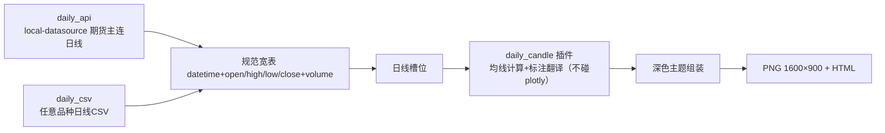

# quant-chart 日线蜡烛图复刻需求说明书（spec）

> 日期：2026-08-28 · 状态：待评审 · 分支 `feat/daily-candle`
> 参考样张：`reference/01–05`（自《集群投研报告004期》导出）· 上游设计：`2026-08-27-quant-chart-design.md`

## 1. 背景与目标

《集群投研报告004期》含 4 幅**深色底期货策略日线蜡烛图**（01 伦敦金现货、02 沪铜主力、03 30年国债期货TL、05 IM2612合约）与 1 幅浅色分钟贴水图（04，即本项目 basis_zones 原生产物）。

目标：在 quant-chart 现有机制（YAML → 适配 → 槽位 → 插件 → 原语渲染）内**扩展日线能力**，同款复刻 4 幅深色图。两期交付：

- **一期**：打通日线链路，复刻样板 05_IM2612，产出可复用机制与配置模板；
- **二期**：一期验收通过后，同一框架内以**纯配置**复刻 01/02/03，另行出实施计划。

## 2. 需求范围

| 在范围 | 不在范围 |
|---|---|
| 日线数据通道（期货主连 API + 通用 CSV 兜底） | 贴水图 04（分钟数据，另行安排） |
| 日线槽位、深色主题、6 类新渲染原语、daily_candle 插件 | `trades` 买卖点的日线口径适配 |
| 一期样板 05 的标注配置 | 二期三幅图的标注配置（一期只交付机制） |
| 分钟主路径**零改动**（硬约束） | 交互式标注编辑（出图=静态 PNG + 可缩放 HTML） |

## 3. 总体需求

1. **旁路原则**：`input.mode` 以 `daily_` 开头即路由到独立日线管线；复用插件注册表、panels 合并、events 接线；分钟路径行为与测试不受影响。
2. **分层不变**：插件只算不画；视觉一律经通用原语翻译；「数据/计算/外观」三层配置理念延续；错误信息定位到字段路径。
3. **风格同款优先**：以与参考样张目视一致为验收口径，不追逐与原图逐点一致（主连拼接口径差异容忍）。

## 4. 功能需求

### FR-1 日线数据通道

定性：两条通道取**单品种日线 OHLCV**，输出规范宽表与质量脚注；未安装依赖、文件缺失、区间越界必须明确报错并给补数/安装指引，绝不静默降级。

- `daily_api`：经 local-datasource 库直调 `query_futures(period="daily")`，模式对齐现有 `local_ds.py`（库直调 + CSV 读回）；主连代码（`IM0`/`CU0`/`TL0`）依赖其自动归一；未安装时给安装指引。锁定基线 `d106144`。
- `daily_csv`：通用日线 CSV，列名中英兼容（`日期/date`、`开盘价/open`、`最高价/high`、`最低价/low`、`收盘价/close`、`成交量/volume`），任意历史、离线可用。

关键函数与变量：
- `load_daily(input_cfg: dict) -> tuple[pd.DataFrame, QualityReport]`（通道分派）
- 宽表列规范：`datetime, open, high, low, close, volume`
- `QualityReport` 增日线口径脚注（`数据来源:…；交易日N天`），分钟口径字段语义不变

### FR-2 日线槽位

定性：每交易日占一格、非交易日（周末/节假日）压缩；刻度与分隔自适应区间长度。

- 关键函数：`build_daily_slots(df: pd.DataFrame) -> Slots`（复用现有 `Slots` 结构，分钟引擎不改）
- 行为要求：`pos = 0..n-1` 连续；`day_span = {date: (pos, pos)}`；月界生成分隔线位
- 刻度规则：区间 > 阈值（约 90 交易日，主题常量）按月刻度 `YY-MM`（如 `26-06`），否则按周刻度 `MM-DD`

### FR-3 渲染原语（新增 6 类 + 复用 2 类）

定性：全部基于 pos 数值轴与 `Ctx`，日期字符串统一经 `_xof` 解析；只翻译、不算数。

| type | 职责（定性） | 关键参数 |
|---|---|---|
| `candle` | 深色底蜡烛图，涨跌色可配 | open/high/low/close 列名、up/down 色 |
| `trendline` | 任意两点趋势线/通道边线，可带标签 | `from`/`to`=`[日期, 价]`、`dash`、`color`、`width`、`label` |
| `arrow` | 带箭头引线（区间目标、支撑提示、走势预演分叉） | `from`/`to`（或 `from`+偏移）、`color`、`width`、`text` |
| `tag` | 右缘彩色药丸标签（价格数字/BULL/BEAR） | `value`、`text`、底色、字色 |
| `circle` | 关键点圆圈标记 | `at`=`[日期, 价]`、`size`、`color` |
| `text` | 自由彩字标注（品种名、通道名等） | `at`、`text`、`size`、`color` |
| `hline`（复用） | 水平支撑/压力/多空分界线 | `value`、`color`、`dash`、`label` |
| `zone`（复用） | 时间×价格矩形（观察区/红框） | `from`/`to`、`price:[下,上]`、`edgecolor`、`label` |

### FR-4 深色主题图组装

定性：单面板深色主题，对照参考样张取样校准；右缘留白容纳 tag 药丸；底部脚注为日线口径。

- 关键函数：`build_daily_figure(df, slots, panels, rep, title) -> go.Figure`
- 关键变量（模块级主题常量，暂不进 YAML）：`BG/PAPER` 底色、`UP_COLOR/DOWN_COLOR` 涨跌色、`MA_PALETTE` 均线默认色板、`MONTH_TICK_THRESHOLD` 刻度阈值；色值以参考图目视校准

### FR-5 策略插件 daily_candle

定性：算均线、把声明式标注配置翻译为图层 spec；**不 import plotly**。

- 签名：`run(df, slots, ma=[5,10,20,30,60], annotations=None, **params) -> StrategyOutput`
- 计算：`df[f"ma{n}"] = close.rolling(n).mean()`；默认图层 = candle + 均线 × N
- `annotations`：FR-3 八类 type 的映射列表；插件逐条校验（未知 type / 缺关键参数 → 报错定位到条目序号）并翻译为图层 spec 追加进主面板
- `trades` 不支持于日线模式：配置了明确报错提示（接口保留）

### FR-6 YAML 配置与校验

- 一期随附模板 `configs/daily_candle.yaml`（数据段 + `ma` + `annotations` 全要素示例，标注坐标对照参考图校准）
- 校验规则：`daily_api` 必填 `input.api.symbol`；`daily_csv` 必填 `input.csv`；两者必填 `input.range`（闭区间 `[起始日, 结束日]`）；`annotations` 必须为映射列表

### FR-7 流水线路由

`run_daily_pipeline(cfg)`：`daily_*` 前缀路由；复用 `get_strategy` / `merge_panels` / `_wire_events`；出图走 `build_daily_figure`。CLI 命令、参数、输出行为与既有完全一致。

## 5. 数据可用性验证记录（2026-08-28 实测）

| 品种 | 通道 | 结果 |
|---|---|---|
| IM0 中证1000期指主连 | local-datasource @d106144 | ✅ 64 交易日 ×（开高低收/量/持仓/结算价），中文表头，覆盖样板区间 |
| XAU 伦敦金现货 | akshare `futures_foreign_hist('XAU')` | ✅ 5186 交易日（2006→2026-08-28 当日），英文表头；无量（现货），不影响蜡烛/均线 |
| CU0 / TL0 | local-datasource 同接口 | 二期使用（一期机制通用，不逐一预验） |

结论：4 幅图数据全部可得。伦敦金经取数脚本落地 CSV 走 `daily_csv`（外盘未封装进 local-datasource，取数属工具层职责，核心库保持无网络依赖）。

## 6. 约束与非功能需求

- local-datasource 锁定基线 `d106144`；核心库无网络依赖。
- 内部资料不入库：`reference/` 与源 PDF 进 `.gitignore`（已随本 spec 提交）。
- 既有分钟测试零修改；新增覆盖：日线槽位 / 6 原语 / 插件 / 配置校验 / 夹具 CSV 端到端。

## 7. 一期验收标准

1. `pytest -q` 全绿，旧测试零改动。
2. `chartflow run configs/daily_candle.yaml -o out/daily_candle_IM.png --html out/daily_candle_IM.html` 成功，脚注为日线口径。
3. 与 `reference/05_IM2612合约.png` 并排目视，要素逐项齐备：深色蜡烛、5 条均线、水平支撑/压力线、趋势线×2、红框观察区、圆圈标记、箭头+文字、右缘标签（价格/BULL/BEAR）、大字标注、走势预演分叉。
4. 换品种/换股票仅改 YAML（数据源 + 标注），零代码改动。

## 8. 二期范围（一期验收后另行出计划）

| 图 | 数据 | 备注 |
|---|---|---|
| 02 沪铜 | CU0 主连日线 | 原图 X 轴为合约月份，主连拼接近似，风格优先 |
| 03 30年国债 | TL0 主连日线 | 「周线级别下行通道」双虚线、区间价差箭头 |
| 01 伦敦金 | XAU 日线（已验证） | 区间长约一年，刻度走月模式；无量 |

## 9. 风险与开放问题

- 主连拼接口径（换月/复权）与原报告制作口径可能不同 → 以「同款风格、要素齐备」为验收，不追逐点一致。
- akshare 接口可能随时间漂移 → 锁定基线 + 失败时报错指引兜底。
- XAU 成交量为 0 → 蜡烛/均线不受影响；如需成交量面板二期再定。